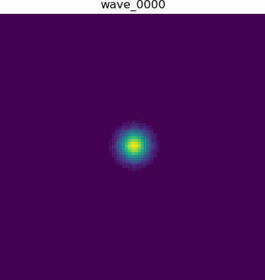

## Introduction

This repository contains a high-performance simulator for two-dimensional incompressible fluid dynamics, solving the Navier–Stokes equations using a finite-difference approach. The main goal is to evaluate and compare different parallelization strategies — serial, OpenMP (multi-threaded CPU), and CUDA (GPU) — applied to the solution of the pressure–velocity coupling problem in fluid simulations.



Originally developed as a final project for the *MC970 – Parallel Programming* course at UNICAMP, the simulator models how a localized pressure perturbation propagates over time. This type of simulation is relevant both academically and practically, appearing in computational fluid dynamics (CFD), computer graphics (e.g. real-time water/smoke effects), and engineering applications.

The project uses a 5-point stencil scheme to discretize spatial derivatives and implements time-stepping with periodic boundary conditions. Because the problem structure is highly parallel, it serves as an excellent benchmark for performance comparison between CPU and GPU architectures.

---

# Fluid Waves Simulator

A high‑performance mini‑benchmark that solves a 2‑D incompressible Navier‑Stokes pressure–velocity coupling problem. Three executables are provided:

* **serial** – baseline single‑threaded C implementation.
* **openmp** – shared‑memory CPU version using OpenMP.
* **cuda** – GPU‑accelerated version written in CUDA C/C++.

Created as part of the MC970 Parallel Computing course at UNICAMP to explore algorithmic optimisation and heterogeneous computing.

> **Project status:** \:construction: early prototype – a full technical report (`report.pdf`) will be added soon.

---

## Features

* Structured‑grid finite‑difference solver (pressure‑velocity coupling).
* Spatial & temporal blocking (compile‑time tunable: `TILE`, `TB`).
* CUDA kernel uses shared memory and halo pre‑fetching (`BLOCK_X`, `BLOCK_Y`).
* Python benchmarking notebook (`runner.ipynb`) that sweeps parameters and plots speed‑ups.

---

## Repository layout

```
├── CMakeLists.txt
├── include/            # params.h + common headers
├── src/
│   ├── main_serial.c
│   ├── main_openmp.c
│   ├── main_cuda.cu
│   ├── solver.c
│   └── solver_cuda.cu
├── runner.ipynb
├── environment.yml      # Conda environment (CUDA 12.1 + PyTorch etc.)
└── build/               # generated by CMake (ignored by Git)
```

---

## Quick start

### 1 · Clone & optional Python env

```bash
# SSH example
git clone git@github.com:/FreitasVarejo/fluid-simulation-cuda.git
cd fluid-simulation-cuda
# create conda env for plotting (optional)
conda env create -f environment.yml
conda activate fluid-waves
```

### 2 · Build all targets

```bash
cmake -S . -B build -DCMAKE_BUILD_TYPE=Release -DTILE=32 -DTB=1
cmake --build build -j$(nproc)
```

### 3 · Run

```bash
./build/bsrial
./build/openmp
./build/cuda
```

### 4 · Benchmark via Jupyter

```bash
jupyter notebook runner.ipynb
```

---

## Sample results

| variant | cfg      | param | time (s) | speed‑up |
| ------- | -------- | ----- | -------- | -------- |
| serial  | T16\_TB1 | –     | 4.72     | 1.0×     |
| openmp  | T16\_TB1 | 8 thr | 0.77     | 6.1×     |
| cuda    | T16\_TB1 | 16×16 | 0.008    | 588×     |

*Hardware: Intel i7‑13700H + NVIDIA RTX 4070 Laptop.*

---

## Compile‑time parameters

| Flag                 | Default | Description                           |
| -------------------- | ------- | ------------------------------------- |
| `TILE`               |  32     | Spatial cache‑blocking size           |
| `TB`                 |  1      | Temporal blocking iterations per tile |
| `BLOCK_X`, `BLOCK_Y` | 32      | CUDA thread‑block geometry            |

Override with CMake:

```bash
cmake -DTILE=16 -DTB=2 -DBLOCK_X=16 -DBLOCK_Y=16 ...
```
